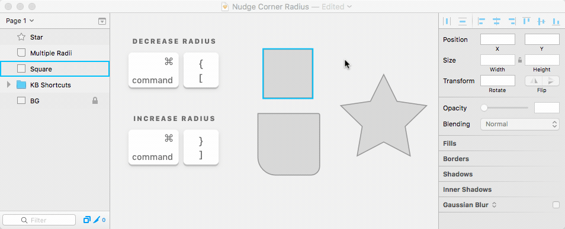

# Nudge Corner Radius Sketch Plugin

Sketch Plugin to quickly change the corner radius of a layer through easy keyboard shortcuts.

## Usage

<kbd>⌘ command</kbd> + <kbd>]</kbd> = Increase corner radius

<kbd>⌘ command</kbd> + <kbd>[</kbd> = Decrease corner radius

**Note: Add <kbd>⇧ Shift</kbd> to increase the nudge size**

The amount the corner radius changes by is based on the user's nudge size:

- default = 1
- default large (shift) = 10

This means that if you change your settings with something like [nudg.it](http://nudg.it), it will respect this preference.

## Why make this plugin? How is it different?

Sometimes using keyboard shortcuts are much easier than manipulating sliders with the mouse.
Even if the values of the layer's corner radii differ — this plugin will respect that. e.g. `5;10;20;10`

When editing any shape layer, the shortcut also works for nodes that have been selected!

You can also change more than one selected layer at once! Talk about efficiency.

### What about changing window tab or the text alignment — isn't that the same shortcuts?

Yes that's correct. If you didn't know — <kbd>⌘ command</kbd> + <kbd>⇧ shift</kbd> + <kbd>Left or right</kbd> will change the sketch window tab.
Also, <kbd>⌘ command</kbd> + <kbd>[</kbd> will left align text, and <kbd>⌘ command</kbd> + <kbd>]</kbd> to right align.

The cool thing is, these keyboard shortcuts will still work — as long as a shape layer isn't selected.
It's basically contextually aware. 🤖

## Installation

1. [Download the plugin](https://github.com/DWilliames/nudge-corner-radius-sketch-plugin/releases/download/v1.0/Corner.Radius.sketchplugin.zip)
2. Double-click the file, 'Nudge Corner Radius.sketchplugin'
3. That's it...

## Contribute

This plugin is in active development.

Pull requests are welcome and please submit bugs 🐛.

## Contact

* Follow [@davidwilliames](https://twitter.com/davidwilliames) on Twitter
* Email <david@williames.com>

---

If you find this plugin helpful, consider shouting me coffee ☕️ via [PayPal](https://www.paypal.me/dtw/5)

